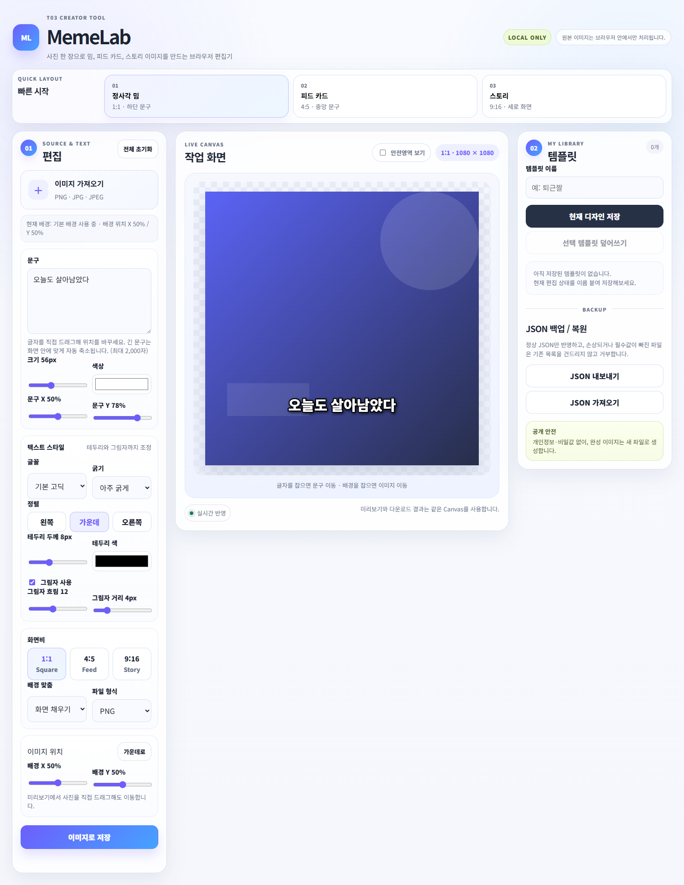

# MemeLab · 짤·카드 스튜디오

사진 위에 문구를 넣고 **글자와 배경을 각각 드래그**해 밈·카드·SNS 이미지를 만드는 웹앱입니다. 밝은 화면에서 편집한 결과를 PNG 또는 JPEG로 저장합니다.

- **편집기:** https://youmjjang.github.io/MEME_CARD/
- **소스:** https://github.com/youmjjang/MEME_CARD
- **제출 문구:** [submission/SUBMISSION.md](submission/SUBMISSION.md)
- **과제 검수표:** [evidence/requirements-check.md](evidence/requirements-check.md)
- **극단 입력 12건과 수정 전후:** [evidence/extreme-input-tests.md](evidence/extreme-input-tests.md)
- **완성 이미지 3개 / 사용 권한:** [evidence/completed-images-record.md](evidence/completed-images-record.md)



## 사용 방법

1. PNG/JPEG를 가져오고 문구를 입력합니다. 기본 배경으로 바로 시작해도 됩니다.
2. 미리보기의 **글자 위를 잡으면 문구**, **배경을 잡으면 사진**이 움직입니다. 글꼴·색상·크기·정렬·테두리·그림자를 조절하고 1:1 / 4:5 / 9:16 비율을 고릅니다.
3. `이미지로 저장`을 눌러 다운로드합니다. 이름을 입력하고 `현재 디자인 저장`을 누르면 나중에 템플릿을 불러오거나 수정·삭제할 수 있습니다.

## 구현 및 범위

- HTML / CSS / JavaScript, Canvas, localStorage. 서버·로그인·외부 이미지 전송 없음.
- 미리보기와 저장에 같은 렌더러를 사용합니다. 안전영역 가이드만 저장 파일에서 제외합니다.
- 긴 문구는 자동 줄바꿈·자동 축소하고 화면 안으로 위치를 제한합니다. 결합 이모지는 글자 묶음 단위로 처리합니다.
- 템플릿에는 문구·좌표·스타일·이미지와 이미지 위치가 저장되며 JSON 백업/복원을 지원합니다.
- JSON 전체 검증과 이미지 디코딩 후 저장합니다. 문법/필수값/ID 중복/이미지 오류 및 저장 공간 부족 시 기존 템플릿을 보존합니다.
- 입력: PNG/JPEG 15MB 이하, 문구 2,000자, 템플릿 50개, JSON 20MB 이하. 이미지 긴 변은 최대 2,160px로 정규화하고 메타데이터를 복사하지 않습니다.
- 저장은 브라우저 기본 다운로드 방식입니다. 실제 경로는 브라우저 설정을 따릅니다.
- 템플릿 저장은 해당 브라우저와 사이트 주소에 한정됩니다. 브라우저 데이터 삭제 전 JSON을 백업하세요. 저장 용량은 브라우저 정책에 따릅니다.
- 글꼴은 시스템 글꼴을 사용하므로 다른 기기에서는 모양이 달라질 수 있습니다. 같은 기기의 미리보기와 저장 결과는 일치합니다.

## 실행과 검증

일반 사용에는 설치가 필요 없습니다. 공개 편집기를 열거나 `index.html`을 엽니다. 안정적인 저장 범위를 위해 공개 주소에서 사용하는 것을 권장합니다.

자동 검사에는 Node.js와 Microsoft Edge를 사용합니다.

```sh
npm install
npm test
```

`scripts/verify.cjs`가 임시 로컬 서버와 새 브라우저 컨텍스트를 만들어 23개 검사 묶음을 실행합니다. 극단 입력 12건, 세 화면비 PNG 원본 일치, JPEG 저장, 글자/배경 드래그, 모바일 터치, 템플릿 CRUD, JSON 및 저장 실패 복구를 확인합니다. 결과는 `evidence/`에 저장됩니다. Chrome에서는 `BROWSER_CHANNEL=chrome` 환경변수를 지정할 수 있습니다.

검사 기록은 2026-09-11 실제 실행 결과이며 모든 브라우저·임의의 외부 입력에 대한 무제한 보장을 뜻하지는 않습니다.

## 폴더

- `assets/`: 프로젝트에서 코드로 만든 가로 PNG, 세로 JPEG, 투명 PNG
- `test-data/`: 정상 / 문법 손상 / 필수값 누락 JSON
- `scripts/`: 샘플 생성 및 재실행 가능한 자동 검사
- `evidence/`: 실제 검사 기록, 캡처, 완성 이미지, 안전 점검
- `submission/`: 제출 필드에 붙여넣을 문구

샘플 그림은 `scripts/generate-samples.cjs`로 생성한 자체 도형 그래픽입니다. 외부 사진이나 폰트 파일을 포함하지 않습니다. AI 사용과 학생의 결정은 제출문에 구분했습니다.
