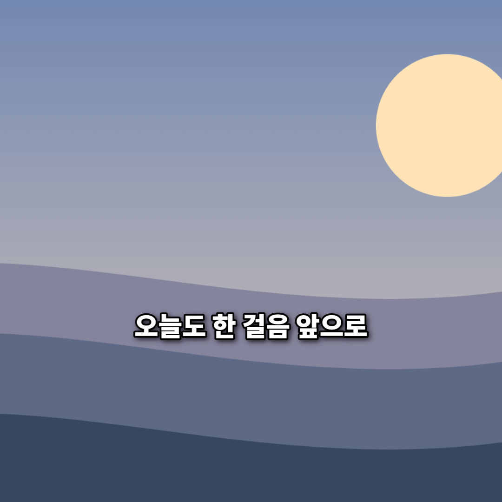
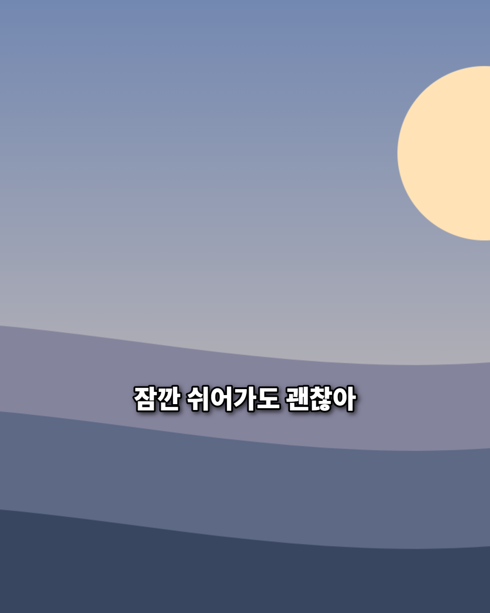
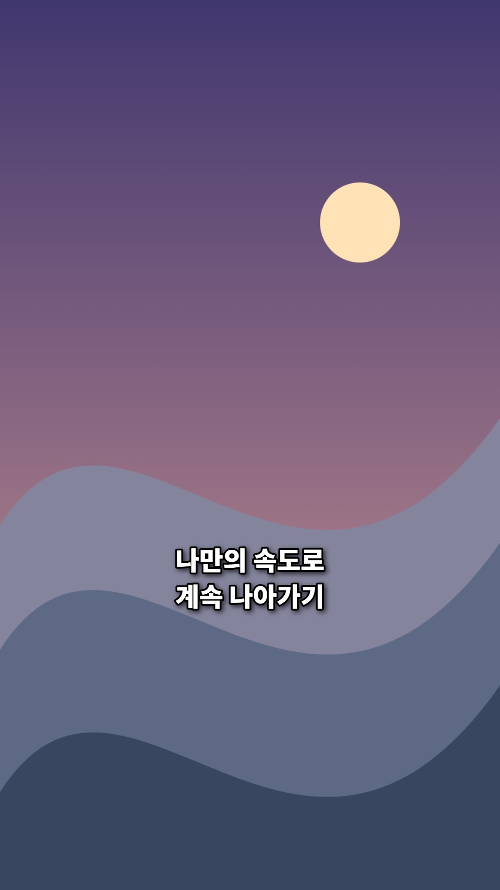

# 완성 이미지 3개

2026-09-11에 최종 앱의 `이미지로 저장` 버튼을 눌러 생성했습니다. 각 PNG는 저장 직전 미리보기 Canvas와 바이트가 일치하며 이미지 디코더로 정상 열림을 확인했습니다.

| 파일 | 비율·크기 | 문구 | 제작/사용 권한 | 결과 |
|---|---|---|---|---|
| [1:1 완성본](finished-card-1x1.png) | 1:1 · 1080×1080 | 오늘도 한 걸음 앞으로 | 본인 프로젝트 자체 제작, AI 코드 보조 | 정상 열림 / GPS 0 |
| [4:5 완성본](finished-card-4x5.png) | 4:5 · 1080×1350 | 잠깐 쉬어가도 괜찮아 | 본인 프로젝트 자체 제작, AI 코드 보조 | 정상 열림 / GPS 0 |
| [9:16 완성본](finished-card-9x16.png) | 9:16 · 1080×1920 | 나만의 속도로 / 계속 나아가기 | 본인 프로젝트 자체 제작, AI 코드 보조 | 정상 열림 / GPS 0 |

원본 배경은 [샘플 생성 코드](../scripts/generate-samples.cjs)로 그린 그라데이션·원·곡선 도형입니다. 외부 이미지 원본이 없으므로 외부 출처 URL이나 제3자 이미지 라이선스는 해당하지 않습니다. 학생이 수작업으로 그림을 그렸다는 의미는 아니며 AI 코드 보조 제작임을 명시합니다.

