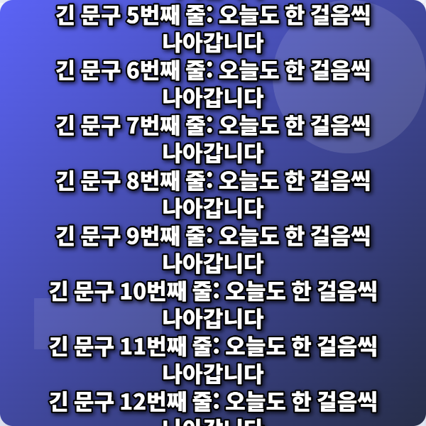
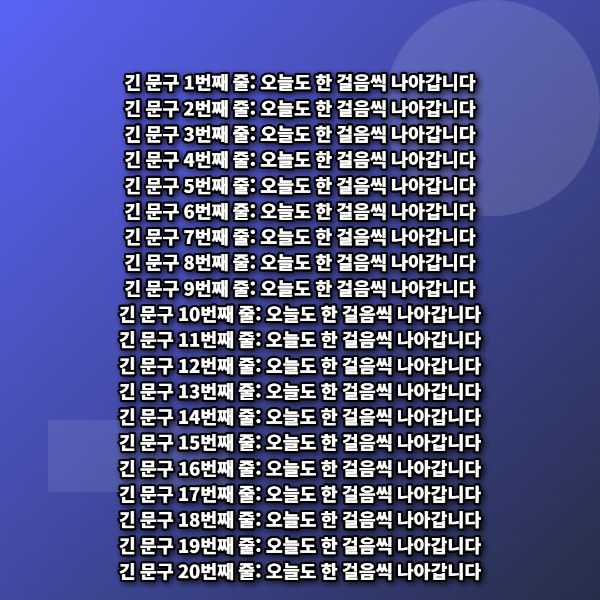

# 극단 입력 12건 — 실제 실행 기록

2026-09-11, Microsoft Edge 152.0.4191.66의 새 브라우저 컨텍스트에서 검사했습니다. 각 입력 후 실제 다운로드를 실행하고 PNG 바이트와 미리보기 Canvas를 대조했습니다. 모든 12건 PASS입니다.

| 번호 | 입력 종류 | 입력 | 예상 결과 | 실제 결과 |
|---|---|---|---|---|
| 01 | 긴 한글 20줄 | 긴 문구 1번째 줄: 오늘도 한 걸음씩 나아갑니다 / 긴 문구 2번째 줄: 오늘도 한 걸음씩 나아갑니다 / 긴 문구 3번째 줄: 오늘도 한 걸음씩 나아갑니다 / … (전체 입력은 JSON 기록) | all lines fit; baseline reproduction | PASS · [저장 이미지](test-01.png) |
| 02 | 긴 영문 | ThisIsAVeryLongEnglishSentenceWithoutSpacesThisIsAVeryLongEnglishSentenceWithoutSpacesThis… (전체 입력은 JSON 기록) | automatic wrapping | PASS · [저장 이미지](test-02.png) |
| 03 | 한글·영문 혼합 | 오늘 Meeting is at 3PM in Room B. 함께 시작해요! | mixed scripts visible | PASS · [저장 이미지](test-03.png) |
| 04 | 명시적 줄바꿈 | 첫째 줄 / 둘째 줄 / 셋째 줄 | three lines | PASS · [저장 이미지](test-04.png) |
| 05 | 이모지 | 오늘도 화이팅 😀😂🔥 👨‍👩‍👧‍👦 👍🏽 🇰🇷 | whole grapheme clusters | PASS · [저장 이미지](test-05.png) |
| 06 | 빈 문구 | (빈 문구) | background only | PASS · [저장 이미지](test-06.png) |
| 07 | 짧은 문구 | 가 | single glyph | PASS · [저장 이미지](test-07.png) |
| 08 | 세로 JPEG | 세로 사진도 자유롭게 | JPEG decode/cover | PASS · [저장 이미지](test-08.png) |
| 09 | 가로 PNG | 넓은 하루의 시작 | PNG decode/cover | PASS · [저장 이미지](test-09.png) |
| 10 | 투명 PNG | 투명 배경 합성 | transparent pixels composited | PASS · [저장 이미지](test-10.png) |
| 11 | 특수문자 | !@#$%^&*()[]{}<> / & "quotes" | literal text, no HTML | PASS · [저장 이미지](test-11.png) |
| 12 | 지원하지 않는 파일 | 기존 작업을 지켜주세요 | reject + preserve canvas and state | PASS · [저장 이미지](test-12.png) |

## 대표 결함: 동일 입력 수정 전 FAIL → 수정 후 PASS

- 입력: `긴 문구 1번째 줄: 오늘도 한 걸음씩 나아갑니다`부터 20번째 줄까지 명시적 줄바꿈으로 이어 붙인 문자열. [정확한 전체 입력](before-long-text.json)
- 수정 전: 원래 받은 ZIP의 렌더러에서 아래쪽 문장이 Canvas 높이 1080px 밖으로 나갔습니다. 기록된 마지막 문장 기준 y=2207.4px, FAIL.
- 수정: 전체 문단의 줄 수와 높이를 먼저 측정해 글꼴 크기를 자동 축소하고, 문구의 전체 영역을 Canvas 안으로 제한했습니다. 좌표를 렌더링 전에 동일하게 정규화해 저장 시 위치가 달라지지 않게 했습니다.
- 수정 후: 동일한 20줄 입력에서 모든 줄의 영역이 Canvas 내부에 있으며, 저장 PNG와 미리보기가 일치합니다. PASS.
- 원본 ZIP SHA-256: `145B9A6CB27D624C501D0ECB70DCE2636EF4795B68E25B70AB022776951E25C2`
- [원래 drawText 함수](original-draw-text.txt) / [전체 검사 JSON](test-results.json)

| 수정 전 — FAIL | 수정 후 — PASS |
|---|---|
|  |  |

## 추가 검사

글자 드래그(세 비율 × 세 정렬), 배경 드래그 시 글자 유지, 기본 배경 위 글자 드래그, 모바일 터치, 문구 위치·크기·색상, 안전영역 제외 저장, 템플릿 CRUD 및 새로고침, JSON 정상 복원/문법 오류/필수 누락, 저장 공간 부족, 중복 ID, 손상 이미지의 기존 작업 보존을 추가 확인했습니다.

텍스트 관련 검사는 줄 영역, 명시적 줄바꿈, 이모지 묶음 분리, 저장 결과를 자동 확인하고 대표 이미지도 육안 확인했습니다. 모든 기기의 모든 글꼴을 검증했다는 의미는 아닙니다.
