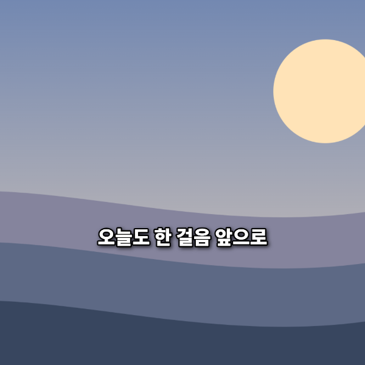
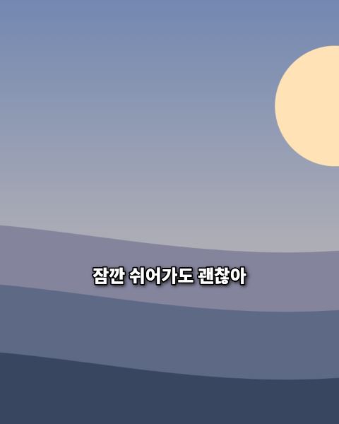
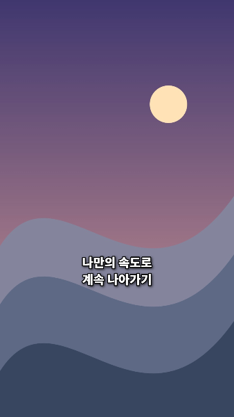

# 세 화면비의 미리보기 / 다운로드 대조

2026-09-11 실제 편집기의 `이미지로 저장`을 실행했습니다. 다운로드 직전 Canvas의 PNG 데이터와 다운로드 파일의 바이트가 세 비율 모두 일치했습니다. 다음 미리보기 이미지는 브라우저 화면의 Canvas를 캡처한 것입니다.

| 화면비 | 브라우저 미리보기 | 실제 다운로드 | 결과 |
|---|---|---|---|
| 1:1 |  | [1080×1080 PNG](finished-card-1x1.png) | PASS |
| 4:5 |  | [1080×1350 PNG](finished-card-4x5.png) | PASS |
| 9:16 |  | [1080×1920 PNG](finished-card-9x16.png) | PASS |

이미지 잘림·문구 위치·줄바꿈을 같은 렌더러로 생성합니다. `안전영역 보기` 가이드는 저장 파일에 들어가지 않음을 별도로 확인했습니다. JPEG 저장도 실제 다운로드 후 정상 디코딩을 확인했습니다.

검사 이름 `C11-C13, C25-C26`과 `Safe guide excluded from export`의 상세 결과는 [실행 기록](test-results.json)에 있습니다.
